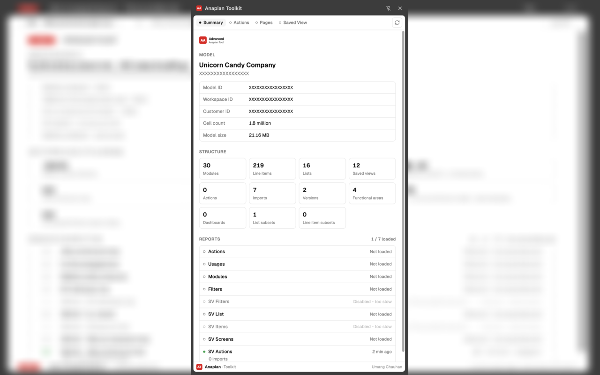
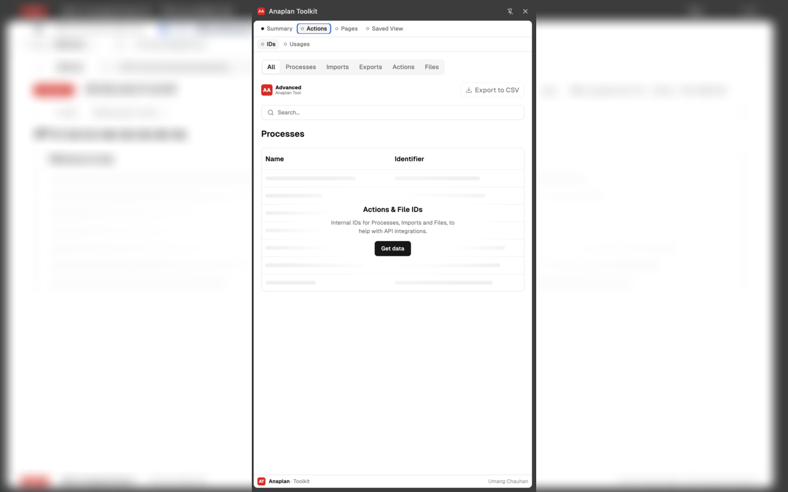
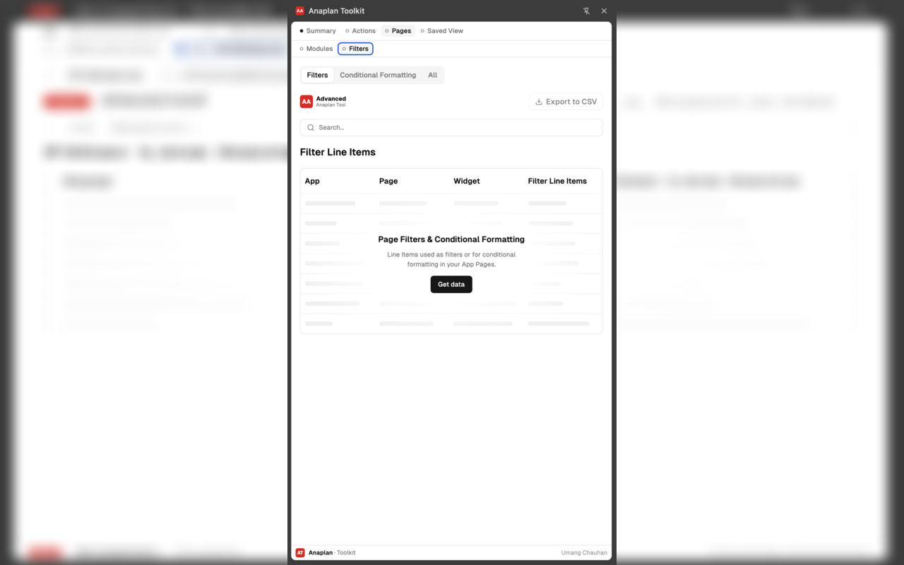
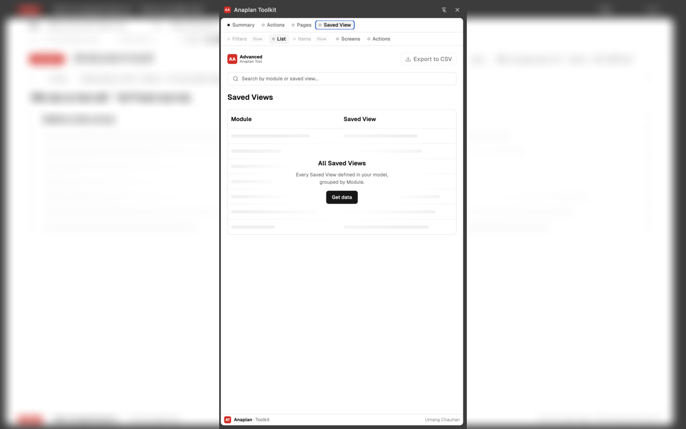

# Anaplan Toolkit

Chrome and Firefox extension for analysing Anaplan models. Not affiliated with, endorsed by, or
supported by Anaplan, Inc.

**Author:** Umang Chauhan
**Copyright:** © 2026 Umang Chauhan. All rights reserved.
**Licence:** Proprietary — see [LICENSE.txt](LICENSE.txt). You may install and use this
extension; you may not copy, redistribute, or reuse its code.

---

## What it does

Opens a side panel of reports, each gathered on demand from the Anaplan
model in the active tab:

| View | What it shows |
|---|---|
| **Actions** | Internal IDs for Processes, Imports and Files, for API integrations |
| **Usages** | Where Actions are used across Apps and Pages |
| **Steps** | The actions each process runs, in order, with each import's source and target; actions no process runs; a *Copy API call* button (Integration API `curl`) per process and action |
| **Modules** | Which Apps and Pages consume each module (backend → frontend lineage) |
| **Filters** | Line Items used as page filters or for conditional formatting |
| **SV Filters** | *Disabled* — Line Items used as filters in Saved Views (too slow on large models, see below) |
| **SV Screens** | Which Saved View each App Page widget reads from |
| **SV Actions** | Imports whose source is a Saved View — see the caveats below |
| **Structure › Modules** | Every module with its ID, dimensions, line item and saved view counts, and the App pages that use it |
| **Structure › Line Items** | Every line item with its ID, format, applies-to, time scale, summary and formula — search matches formulas |
| **Structure › Lists** | Every list with its ID and parent, and every list property with its format and formula |
| **Workspace** | Models and storage in this workspace, and across every workspace you can access |

Every view exports to CSV and has a search box, and Summary has **Get all data** (gathers every
report not loaded yet, one after another) and **Download all as CSV** (zips every loaded report's
CSV files into one download). The Structure reports read Anaplan's in-page
model data, so they make no extra requests (Modules also reads the App page list). Fields Anaplan
doesn't expose there for a given model show as empty, and the page says which. The *Copy API call*
buttons only copy a request to the clipboard — the extension never runs a process or action. Results are cached per model
for 6 hours; the refresh icon re-gathers.

**SV Filters and SV Items are disabled** (shown greyed out, tagged *Slow*). Both have to open
every saved view, and Anaplan evaluates each view's filters before it answers — a few views on
large modules take a minute or more each, so a full run on a large model takes tens of minutes.

**SV Actions caveats.** Only imports are scanned, via `importDefinition.source`
— the one action source field whose shape is confirmed (the **Actions** view
already renders it as "Source Identifier"). Exports and processes are not
scanned. That source is an import data source (`_113…_`), not the view itself;
its definition's `objectId` names the saved view it reads. Only data sources
from the model you have open are resolved, so an import reading a view in
*another* model cannot be named and is not listed. Both caveats are also shown on the page itself.

## Screenshots

| Summary | Actions & File IDs |
|---|---|
|  |  |
| **Page Filters & Conditional Formatting** | **All Saved Views** |
|  |  |

## Install

**Chrome / Edge / other Chromium browsers**

1. Open `chrome://extensions`
2. Enable **Developer mode**
3. **Load unpacked** → select this folder (or `dist/` after running `sh package.sh`)
4. Open an Anaplan model, then click the toolbar icon to open the side panel

**Firefox**

1. Run `sh package.sh` to build `dist-firefox/`
2. Open `about:debugging#/runtime/this-firefox`
3. **Load Temporary Add-on** → select any file inside `dist-firefox/` (e.g. `manifest.json`)
4. Open an Anaplan model, then click the toolbar icon to open the sidebar

A temporary add-on is removed when Firefox restarts, so you'll need to reload it each session
during development. Firefox 140+ is required (AMO's mandatory data-collection disclosure key,
`data_collection_permissions`, needs 140+; the `world: "MAIN"` content script used to read
Anaplan's in-page data only needs 128+).

## Keyboard shortcuts

Inside the Anaplan modelling UI (`⌘⌥` on macOS, `Ctrl+Alt` on Windows/Linux):

| Shortcut | Anaplan tab | Opens |
|---|---|---|
| `⌘⌥I` | Actions | Actions & File IDs |
| `⌘⌥O` | Actions | Action Usages |
| `⌘⌥I` | Modules | Linked Pages |
| `⌘⌥O` | Modules | Page Filters & Conditional Formatting |

## Privacy

The extension talks to **no server other than Anaplan itself**. There is no
analytics, no telemetry and no auto-update endpoint. The only network calls are
to `<your-anaplan-host>/a/springboard-definition-service/...` and
`<your-anaplan-host>/jsonrpc`, using your existing session. Results are held in
`storage.session` (falling back to `storage.local` if unavailable) and are
dropped when the browser closes.

Permissions requested:

| Permission | Why |
|---|---|
| `host_permissions: https://*.anaplan.com/*` | read model metadata from the tab you have open |
| `sidePanel` (Chrome only — Firefox's sidebar needs no permission) | render the UI |
| `storage` | cache results for the session |

## Layout

```
manifest.json          extension manifest (shared; carries both Chrome's and
                        Firefox's browser-specific keys side by side)
background.js          background script: routing, caching, progress
sidepanel.{html,js,css}  side panel shell that hosts the seven report pages
content-scripts/
  outer.js             keyboard shortcuts in the modelling UI frame
  inner.js             report engine (fetches and assembles every report)
  main.js              MAIN-world reader for Anaplan's in-page model cache
chunks/                compiled report renderers, plus sv_shared.js and the
                       two hand-written SV Screens / SV Actions renderers
*.html                 the seven report pages, loaded as side panel iframes
```

## Notes for maintainers

- `popup.html` and `chunks/popup-*.js` are **not referenced by the manifest** —
  the side panel replaced the popup. They are kept only for reference and can
  be deleted.
- Files ending `.bak`, `.pre-*` and `.retired` are development snapshots.
  Delete them before packaging.
- Five of the report pages are compiled Svelte (`chunks/<page>-<hash>.js`) and
  there is no Svelte source in this repository — those chunks are committed
  build output. `sv_screens` and `sv_actions` are therefore plain ES modules
  sharing `chunks/sv_shared.js`, which carries its own copies of the CSV
  writer and the search scorer so all seven views behave identically.

See [NOTICE.txt](NOTICE.txt) for third-party components and provenance.
